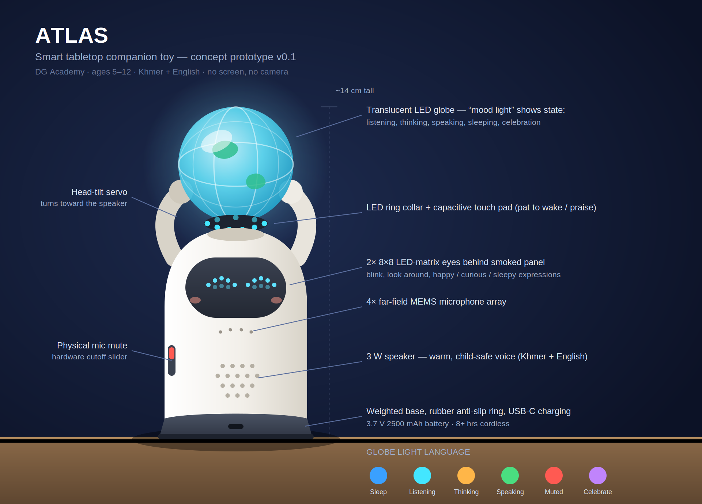

# Atlas — Smart Tabletop Companion Toy

**Design Document v0.1**
**Project:** DG Academy — Atlas
**Status:** Concept / Draft



---

## 1. Vision

Atlas is a friendly, palm-to-desk-sized smart toy that lives on a table — a desk at home,
a classroom table, or the family living room. It looks like a small globe-holding robot
character, and inside it carries a "smart brain": an AI voice companion that can talk,
teach, play games, and answer questions in both **Khmer and English**.

Atlas is designed around three promises:

1. **A friend, not a screen.** Atlas has no display for passive video. It communicates
   through voice, light, motion, and sound — encouraging conversation and imagination
   instead of screen time.
2. **A teacher in disguise.** Every interaction is a chance to learn: vocabulary,
   numbers, science questions, stories about Cambodia and the world.
3. **Safe by design.** Built for children ages 5–12, with strict privacy controls,
   parent-managed settings, and age-appropriate content filtering.

---

## 2. Product Overview

| Attribute | Specification |
|---|---|
| Name | Atlas |
| Category | Smart educational companion toy |
| Target age | 5–12 years (primary), family use (secondary) |
| Placement | Tabletop / desktop (stationary, no wheels) |
| Size | ~14 cm tall × 10 cm diameter base |
| Weight | ~350 g (stable, hard to knock over) |
| Power | USB-C, internal rechargeable battery (8+ hrs active use) |
| Connectivity | Wi-Fi (2.4/5 GHz), Bluetooth LE (for parent app pairing) |
| Languages | Khmer, English (extensible) |
| Price target | < $79 USD retail |

### 2.1 Character & Form

Atlas is a round-bodied robot character holding a small globe above its head — a nod to
the mythological Atlas, and to the idea that *knowledge of the whole world* sits in a
child's hands.

- **Body:** Soft-touch, matte ABS plastic with rounded edges everywhere (no pinch
  points, drop-safe from table height).
- **Globe:** A translucent dome that doubles as the main **light indicator** — it glows
  and animates with color to show Atlas's "mood" and state (listening, thinking,
  speaking, sleeping).
- **Face:** Two simple LED-matrix eyes behind a smoked panel. Eyes blink, look around,
  and form simple expressions (happy, curious, sleepy). No mouth — the voice and globe
  carry the expression.
- **Head tilt:** A single quiet servo lets Atlas tilt its head toward the speaker when
  listening — small motion, big personality.
- **Weighted base:** Low center of gravity with a rubber ring so it stays planted on
  the table.

---

## 3. The Smart Brain

The "smart brain" is a hybrid of on-device intelligence (fast, private, works offline)
and cloud AI (deep knowledge, natural conversation).

### 3.1 Hardware Architecture

```
        ┌──────────────────────────────────────────┐
        │                ATLAS BRAIN               │
        │                                          │
        │  ┌────────────┐      ┌────────────────┐  │
        │  │  Main SoC  │──────│ 4× MEMS mic    │  │
        │  │ (quad-core │      │ array + DSP    │  │
        │  │  ARM, NPU) │      └────────────────┘  │
        │  └─────┬──────┘                          │
        │        │            ┌────────────────┐   │
        │        ├────────────│ 3W speaker     │   │
        │        │            └────────────────┘   │
        │        │            ┌────────────────┐   │
        │        ├────────────│ LED globe +    │   │
        │        │            │ eye matrices   │   │
        │        │            └────────────────┘   │
        │        │            ┌────────────────┐   │
        │        ├────────────│ Head servo     │   │
        │        │            └────────────────┘   │
        │        │            ┌────────────────┐   │
        │        └────────────│ Sensors: touch │   │
        │                     │ (head pat),    │   │
        │                     │ accelerometer, │   │
        │                     │ ambient light  │   │
        │                     └────────────────┘   │
        └──────────────────────────────────────────┘
```

| Component | Choice (prototype) | Purpose |
|---|---|---|
| Main SoC | Raspberry Pi Zero 2 W class / ESP32-S3 (low-cost variant) | Runs wake word, audio pipeline, device logic |
| Mic array | 2–4 MEMS microphones | Far-field voice pickup across a table |
| Speaker | 3W full-range driver | Clear voice at conversation volume |
| Globe LEDs | 12× addressable RGB (NeoPixel ring) | State/mood indication |
| Eyes | 2× 8×8 LED matrix | Expressions |
| Servo | 1× micro servo (head tilt) | Attention gesture |
| Touch sensor | Capacitive pad on head | "Pat to wake / pat to praise" |
| Accelerometer | 3-axis IMU | Detects pickup, shake-to-shuffle games |
| Mute switch | **Physical** mic cutoff slider | Hardware privacy guarantee |
| Battery | 3.7 V 2500 mAh Li-ion + USB-C charging | Cordless tabletop use |

### 3.2 Software / AI Architecture

```
Child speaks
    │
    ▼
[On-device wake word: "Hey Atlas" / "សួស្តី Atlas"]   ← always offline
    │
    ▼
[On-device VAD + noise suppression]
    │
    ▼
[Speech-to-text]  ── offline fallback: small command set
    │                 (songs, stored stories, quizzes)
    ▼
[Cloud AI brain — LLM with Atlas persona]
    │   • child-safety system prompt + content filters
    │   • curriculum-aware: age level set by parent
    │   • bilingual Khmer/English
    ▼
[Text-to-speech: warm, friendly child-safe voice]
    │
    ▼
Atlas speaks + globe animates + eyes express
```

Key software principles:

- **Wake word runs 100% on-device.** Audio never leaves the toy until the child
  explicitly addresses Atlas.
- **Offline mode is a real mode**, not a failure state: stored stories, math quizzes,
  spelling games, songs, and a simple offline chat persona keep Atlas useful without
  Wi-Fi — important for classrooms and homes with intermittent connectivity.
- **Persona guardrails:** Atlas always speaks as a kind, patient, curious friend. It
  never claims to be human, redirects unsafe topics, and encourages kids to ask a
  trusted adult for personal/medical/emergency matters.
- **Session memory, parent-controlled:** Atlas remembers the child's name, favorite
  topics, and learning progress only if the parent enables it; memory is viewable and
  erasable from the parent app.

### 3.3 Interaction States (Globe Light Language)

| State | Globe | Eyes |
|---|---|---|
| Sleeping / idle | Slow dim blue breathing | Closed |
| Listening | Solid cyan, brightens with voice | Wide open, tracks sound |
| Thinking | Gentle amber swirl | Looking up |
| Speaking | Pulses green with speech rhythm | Animated, blinking |
| Muted (hardware) | Solid red ring | Eyes show "zzz" |
| Low battery | Orange double-blink | Sleepy half-closed |
| Celebration (quiz win) | Rainbow spin | Star eyes |

---

## 4. Learning Experiences

Atlas ships with "Play Packs" — themed activity sets aligned with DG Academy's
learn-by-doing approach:

1. **Word Explorer** — bilingual vocabulary: child says a word in Khmer, Atlas teaches
   the English (and vice versa), then uses it in a story.
2. **Math Buddy** — mental math games with adaptive difficulty; the accelerometer
   enables "shake to shuffle" new problems.
3. **Story Time** — Atlas tells interactive stories (including Cambodian folktales)
   where the child chooses what happens next.
4. **Why? Machine** — open question time: "Why is the sky blue?" "How do volcanoes
   work?" — answered at the child's level.
5. **Quiet Friend** — wind-down mode: soft light, breathing exercises, gentle lullaby
   for bedtime routines.
6. **Classroom Mode** — teacher-facing: spelling bees, table quizzes, timed challenges
   for small groups, with the globe acting as a game-show buzzer light.

---

## 5. Safety & Privacy

- **Physical mute slider** disconnects microphones electrically (not in software).
- **No camera.** Atlas is voice-and-light only by design.
- **Parent app** (companion mobile/web app): set age level, language mix, daily usage
  windows, review/erase memory, see learning summaries.
- **Data minimization:** voice audio is processed and discarded; only transcripts
  needed for the active conversation are retained, encrypted in transit.
- **Compliance targets:** COPPA / GDPR-K style children's privacy practices; toy safety
  EN 71 / ASTM F963 (materials, small parts, battery enclosure).
- **Content safety:** layered filters on both input and output of the cloud brain;
  refusal + gentle redirection for inappropriate topics.

---

## 6. Prototype Roadmap

| Phase | Goal | Duration |
|---|---|---|
| P0 — Proof of concept | Raspberry Pi + USB mic/speaker + LED ring in a 3D-printed shell; wake word + cloud chat loop working | 4–6 weeks |
| P1 — Experience prototype | Add eyes, servo, touch pad, battery; 3 Play Packs; kid testing with DG Academy students | 8 weeks |
| P2 — Design for manufacture | Custom PCB, injection-mold-ready shell, cost-down BOM, safety pre-certification | 12+ weeks |
| P3 — Pilot batch | 50–100 units for classrooms and family beta testers | — |

### Estimated prototype BOM (P0–P1)

| Part | Est. cost (USD) |
|---|---|
| SoC board (Pi Zero 2 W class) | $18 |
| Mic array board | $8 |
| Speaker + amp | $5 |
| LED ring + 2× LED matrix | $7 |
| Micro servo | $3 |
| IMU + touch sensor | $4 |
| Battery + charging board | $9 |
| 3D-printed enclosure | $10 |
| Misc (wiring, switch, base weight) | $6 |
| **Total per prototype** | **~$70** |

---

## 7. Open Questions

- Cloud AI provider and per-conversation cost model at scale (subscription vs. one-time
  purchase with free tier?).
- Khmer speech-to-text quality: evaluate available STT engines for child speech in
  Khmer; may need a hybrid command-grammar fallback.
- Classroom multi-Atlas behavior: how do several Atlases at nearby tables avoid
  responding to each other?
- Should Play Packs be downloadable/expandable through the parent app store model?
